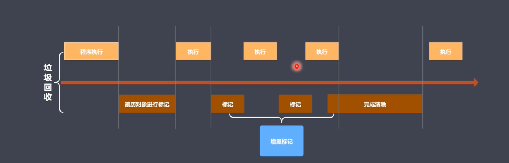

# 性能优化
[toc]

## 1. 内存管理
- 内存： 由可读写单元组成， 表示一片可操作的空间
- 管理： 人为的去操作一片空间的申请，使用和释放
- 内存管理： 开发者主动申请空间， 使用空间，释放空间

1. 申请内存空间: 定义变量
2. 使用内存空间: 变量的读写
3. 释放内存空间: 变量置为null

## 2. JavaScript垃圾回收

1. js中可达对象
   1. 可以访问到的对象就是可达对象（引用，作用域链）

### 2.1 GC算法简述

1. GC的定义与作用
   1. GC就是垃圾回收机制简写
   2. GC可以找到内存中的垃圾，并释放和回收空间
2. GC算法
   1. GC是一种机制，垃圾回收器完成具体的工作
   2. 工作的内容就是查找垃圾释放空间，回收空间
   3. 算法就是工作时查找和回收所遵循的规则
3. 常见GC算法
   1. 引用计数
      1. 核心思想： 设置引用数，判断当前引用数是否为0
      2. 引用计数器
      3. 引用关系时修改引用数字
      4. 引用数字为0时立即回收
      5. 优点： 
         1. 发现垃圾时立即回收
         2. 最大限度减少程序暂停
      6. 缺点：
         1. 无法回收循环引用的对象
         2. 时间开销大
   2. 标记清除
      1. 原理：
         1. 核心思想： 分标记和清除两个阶段完成
         2. 遍历所有对象找标记活动对象
         3. 遍历所有对象清除没有标记的对象
         4. 回收相应的空间
      2. 优缺点
         1. 相对于引用计数来说可以解决对象的相互引用不能回收的问题
         2. 会产生空间碎片化，不能使空间使用最大化
   3. 标记整理
      1. 原理
         1. 标记整理可以看做是标记清除的增强
         2. 标记阶段的操作和标记清除一致
         3. 清除阶段会先执行整理，移动对象位置
      2. 优缺点
         1. 减少碎片化空间
         2. 不会立即回收垃圾对象
   4. 分代回收

## 3. V8
> V8是一款主流的js执行引擎
> V8采用即时编译
> V8设置内存设限

### 3.1 V8回收策略
> 采用分带回收思想
> 内存分为新生代，老生代
> 针对不同现象采用不同算法

V8中常用的GC算法
1. 分代回收
2. 空间复制
3. 标记清除
4. 标记整理
5. 标记增量

### 3.2 V8内存分配
1. V8内存空间一分为二
2. 小空间用于存储新生代对象（32M|16M）
3. 新生代是存活时间比较短的对象

### 3.3 新生代对象回收的实现
  - 回收过程采用复制算法+标记整理
  - 新生代内存区分为两个等大小空间
  - 使用空间为From, 空闲空间为To
  - 活动对象存储于From空间
  - 标记整理后将活动对象拷贝到To

**回收细节**：
 - 拷贝过程中可能出现晋升
 - 晋升就是将新生代对象移动到老生代
 - 一轮GC还存活的新生代需要晋升
 - To空间使用率超过25%

### 3.4 老生代对象说明
 - 老生代对象存放在右侧老生代区域
 - 64位操作系统1.4G， 32位操作系统700M
 - 老生代对象就是指存活时间较长的对象

**老年代对象回收实现**
  - 主要采用标记清除， 标记整理， 增量标记算法
  - 首先使用标记清除完成垃圾空间回收
  - 采用标记整理进行空间优化
  - 采用增量标记进行效率优化

**细节对比**
  - 新生代区域垃圾回收使用空间换时间
  - 老年代区域垃圾回收不适合复制算法
